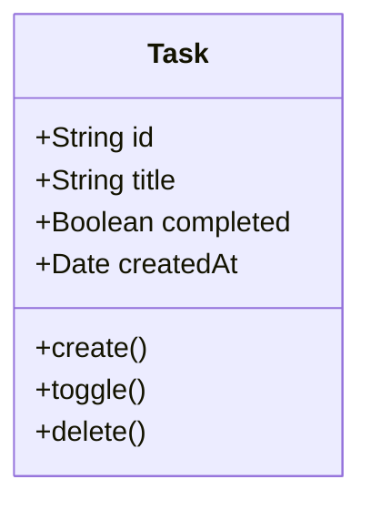
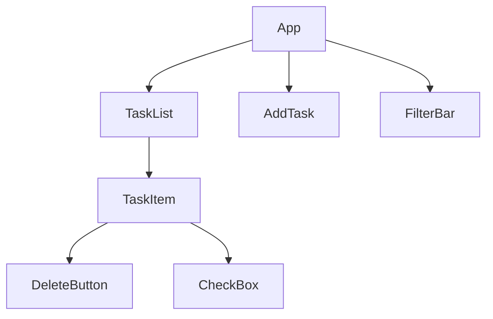
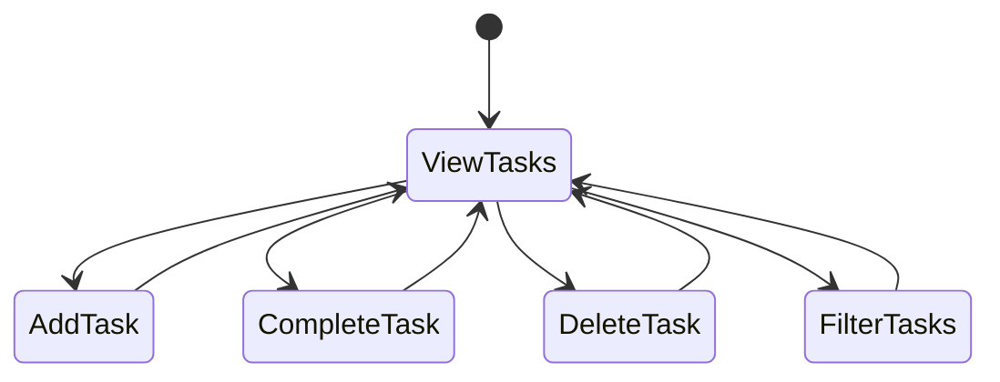

# ToDo App Specification

## Overview
A simple ToDo application that allows users to create, manage, and track their tasks.

## Features
- Create new tasks
- Mark tasks as complete/incomplete
- Delete tasks
- View all tasks
- Filter tasks by status (All/Active/Completed)

## User Stories
1. As a user, I want to add a new task so that I can remember what I need to do
2. As a user, I want to mark tasks as complete so that I can track my progress
3. As a user, I want to delete tasks so that I can remove unnecessary items
4. As a user, I want to view all my tasks so that I can see my full todo list
5. As a user, I want to filter tasks so that I can focus on specific items

## Data Model

## Component Architecture

## User Interface Flow

## Technical Requirements
1. Frontend Framework: React
2. State Management: Local state with React hooks
3. Storage: Local Storage for persistence
4. Styling: CSS Modules or Tailwind CSS

## MVP Scope
- Basic CRUD operations for tasks
- Simple and intuitive UI
- Local storage persistence
- Responsive design

## Future Enhancements
- User accounts
- Task categories
- Due dates
- Task priority levels
- Sorting options
- Dark/Light theme
