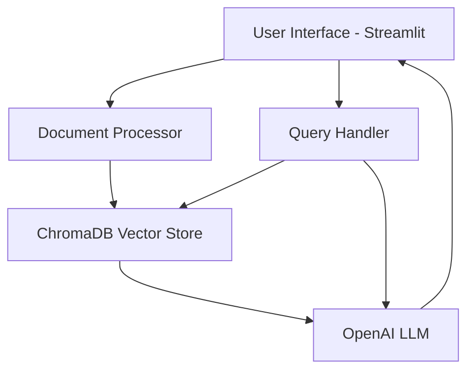

# RAG-based Document Q&A Chatbot Specification

## Project Overview
A Retrieval-Augmented Generation (RAG) chatbot that answers questions based on uploaded DOCX documents using Streamlit, OpenAI, LangChain, and ChromaDB.

## System Architecture



## Technical Components

### 1. Document Processing
- File upload handling for DOCX files
- Text extraction using LangChain document loaders
- Text chunking and embedding generation
- Storage in ChromaDB vector database

### 2. Query Processing
- User query embedding
- Similarity search in ChromaDB
- Context retrieval and prompt construction
- Response generation using OpenAI

### 3. User Interface
- Document upload area
- Chat interface
- History display
- Clear conversation option

## Project Structure
```
solution_bot/
│
├── app.py              # Main Streamlit application
├── requirements.txt    # Project dependencies
├── utils/
│   ├── document.py    # Document processing utilities
│   ├── embeddings.py  # Embedding generation
│   └── chat.py        # Chat logic and RAG implementation
├── config/
│   └── settings.py    # Configuration settings
└── data/
    └── vector_store/  # ChromaDB storage
```

## Dependencies
- streamlit
- langchain
- openai
- chromadb
- python-docx
- typing
- python-dotenv

## Implementation Steps
1. Set up project structure and environment
2. Implement document processing pipeline
3. Configure ChromaDB integration
4. Set up OpenAI and LangChain
5. Create Streamlit interface
6. Implement RAG logic
7. Add error handling and validation
8. Test with sample documents

## Environment Variables
```
OPENAI_API_KEY=your_api_key
CHROMADB_PATH=./data/vector_store
```

## Limitations
- Supports only DOCX files initially
- Response quality depends on document content
- Requires OpenAI API key
- Local ChromaDB storage

## Future Enhancements
- Support for PDF and other document formats
- Multi-document querying
- Response source citations
- Conversation memory
- Document metadata filtering
