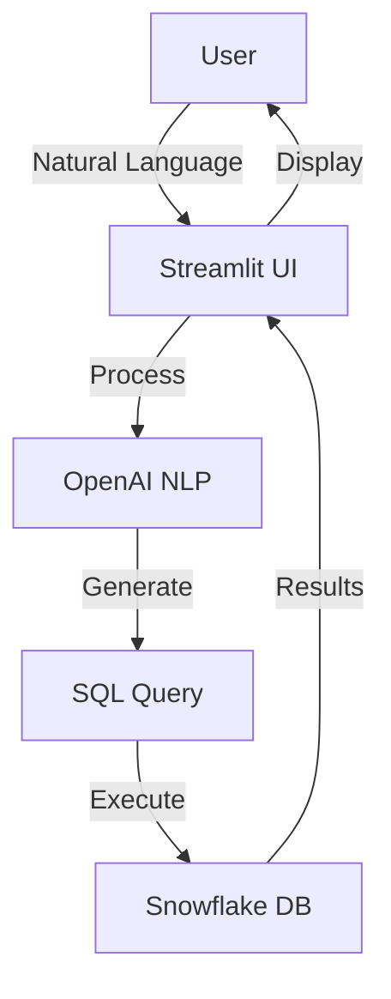
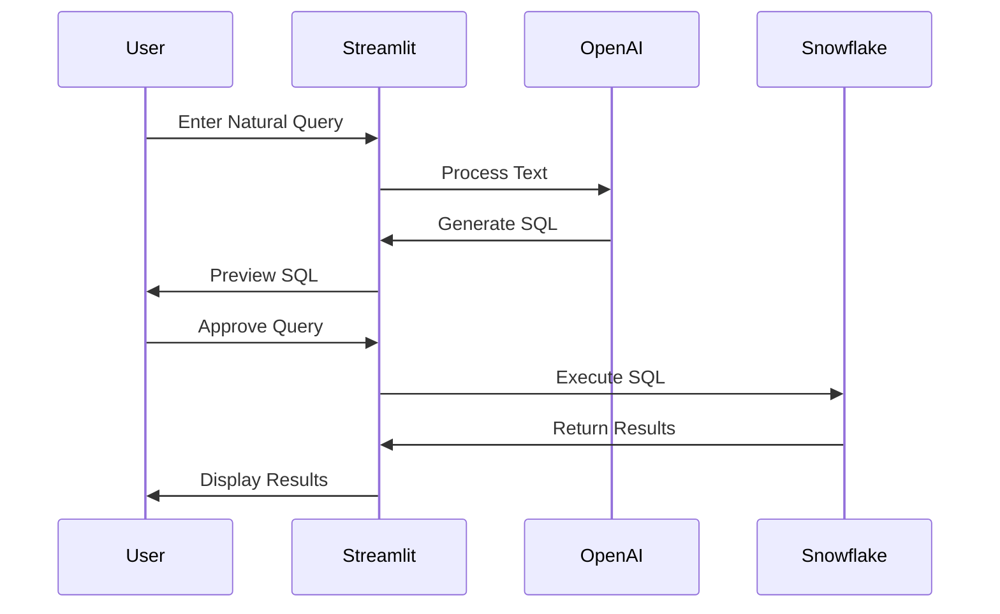

# Snowflake AI Query Generator - Technical Specification

## 1. System Architecture

## 2. Core Components

### 2.1 Natural Language Processing
- OpenAI GPT integration
- Context-aware query generation
- Schema-aware suggestions
- Query validation and safety checks

### 2.2 Snowflake Integration
- Secure connection management
- Query execution and optimization
- Schema metadata extraction
- Result set handling

### 2.3 User Interface
- Natural language input
- Query preview and editing
- Schema visualization
- Results display with pagination
- Export functionality
- Query history

## 3. Data Flow

## 4. Security Considerations
- SQL injection prevention
- Query sanitization
- Access control
- Credential management
- Data privacy

## 5. Technical Requirements

### 5.1 APIs and Services
- OpenAI GPT-4 API
- Snowflake Python Connector
- Streamlit

### 5.2 Database Schema Management
- Automatic schema detection
- Table relationship mapping
- Column type inference
- Query optimization hints

### 5.3 Query Generation
- SQL syntax validation
- Performance optimization
- Error handling
- Query templating

## 6. Performance Requirements
- Query response time < 5 seconds
- AI response time < 2 seconds
- Support for large result sets
- Connection pooling
- Query caching

## 7. User Features
- Natural language query input
- Query history tracking
- Schema browsing
- Query templates
- Export results (CSV, JSON, Excel)
- Query optimization suggestions

## 8. Future Enhancements
- Multi-language support
- Query scheduling
- Custom query templates
- Advanced visualization
- Collaborative features
