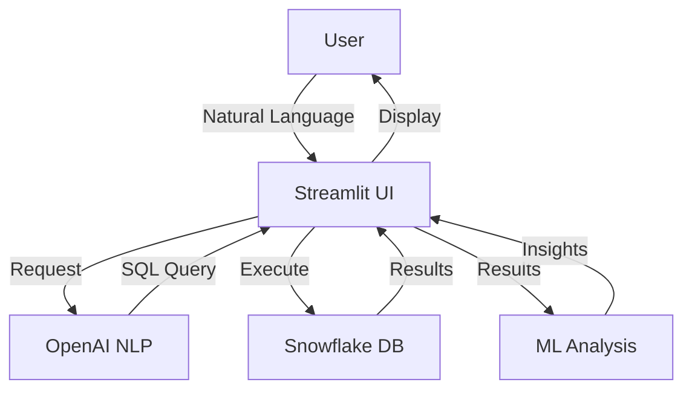
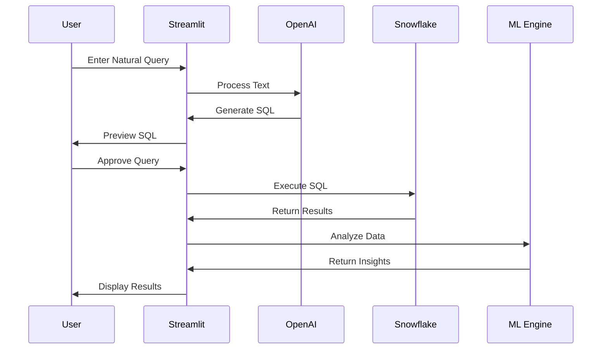
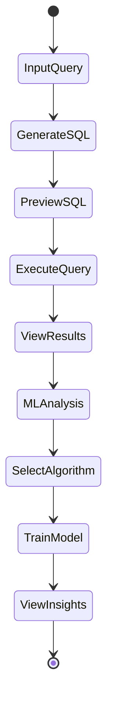
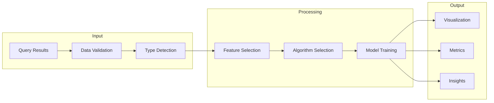

# Snowflake AI Query Generator - Technical Specification

## 1. System Architecture

## 2. Data Flow

## 3. Core Components

### 3.1 Query Generation
- Natural language processing via OpenAI
- SQL query validation
- Schema-aware query generation
- Query optimization suggestions

### 3.2 Machine Learning Analysis
- Automatic algorithm suggestion
- Multiple analysis types:
  - Regression
  - Time Series Analysis
  - Clustering
- Interactive visualization
- Model performance metrics

### 3.3 Database Integration
- Snowflake connection management
- Query execution
- Results caching
- Error handling

## 4. User Interface Flow

## 5. Implementation Details

### 5.1 Query Generation
- OpenAI GPT model integration
- Schema context management
- Query validation pipeline
- Error recovery strategies

### 5.2 ML Analysis Pipeline
- Automated feature detection
- Algorithm selection logic
- Model training workflow
- Results visualization

### 5.3 Data Processing

## 6. Security Considerations
- Credential management
- Query sanitization
- Access control
- Data privacy

## 7. Performance Requirements
- Query response < 5 seconds
- ML analysis < 30 seconds
- UI responsiveness < 1 second
- Cache effectiveness > 90%

## 8. Future Enhancements
- Query template library
- Advanced ML models
- Automated insights
- Batch processing
- Export functionality
