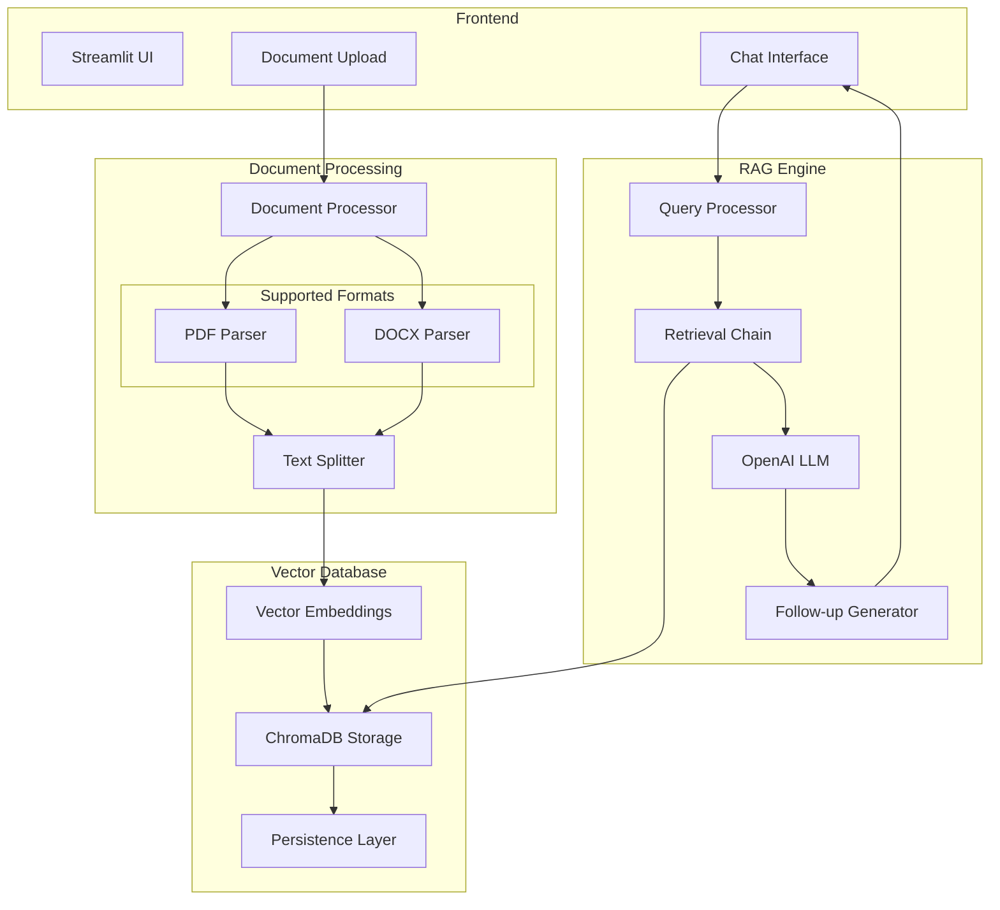
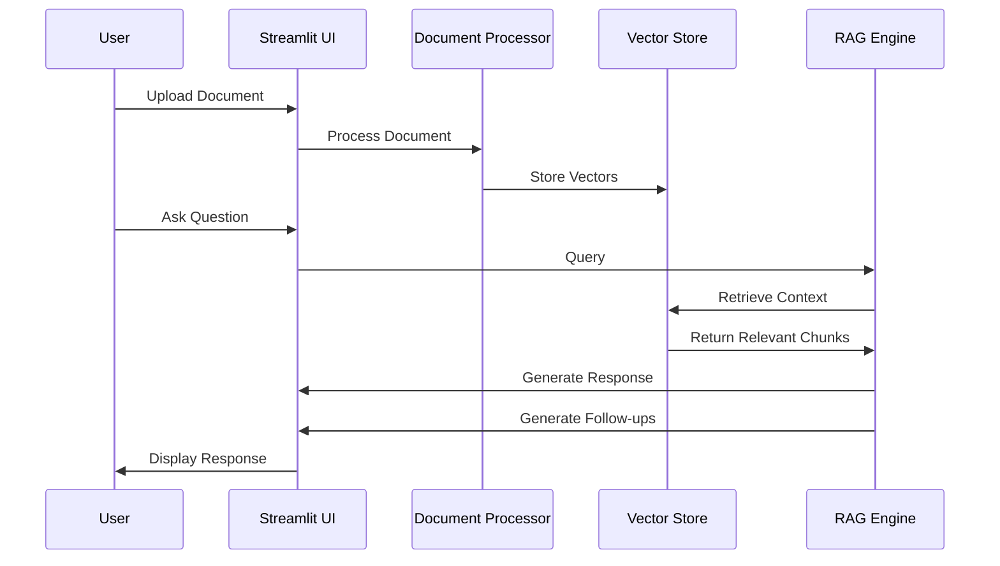

# Document Q&A Chatbot Specifications

## System Architecture



## Component Specifications

### 1. Frontend Layer
- **Framework**: Streamlit
- **Features**:
  - Document upload (PDF/DOCX)
  - Real-time chat interface
  - Follow-up question suggestions
  - Chat history management
  - Clear conversation option

### 2. Document Processing
- **Supported Formats**: PDF, DOCX
- **Chunking Strategy**: 
  - Size: 1000 characters
  - Overlap: 200 characters
- **Processors**:
  - PDF: PyPDF2
  - DOCX: python-docx

### 3. Vector Database
- **Technology**: ChromaDB
- **Features**:
  - Persistent storage
  - Similarity search
  - Metadata tracking
- **Configuration**:
  - Score threshold: 0.7
  - K-nearest: 4 documents

### 4. RAG Engine
- **Components**:
  - OpenAI LLM integration
  - Conversational memory
  - Context-aware retrieval
  - Follow-up question generation

## Technical Requirements

### Dependencies
```plaintext
streamlit==1.24.0
langchain==0.0.228
openai==0.27.8
chromadb==0.3.26
python-docx==0.8.11
tiktoken==0.4.0
python-dotenv==1.0.0
PyPDF2==3.0.1
```

### Environment Setup
- OpenAI API key configuration
- ChromaDB persistence directory
- Python 3.8+ environment

## Data Flow



## Security Considerations
1. API key protection via environment variables
2. Document storage security
3. User session management
4. Rate limiting considerations

## Performance Metrics
- Document processing time
- Response generation latency
- Vector search efficiency
- Memory usage optimization

## Future Enhancements
1. Additional file format support
2. Multi-document context
3. Advanced visualization options
4. Custom model integration
5. Batch document processing
