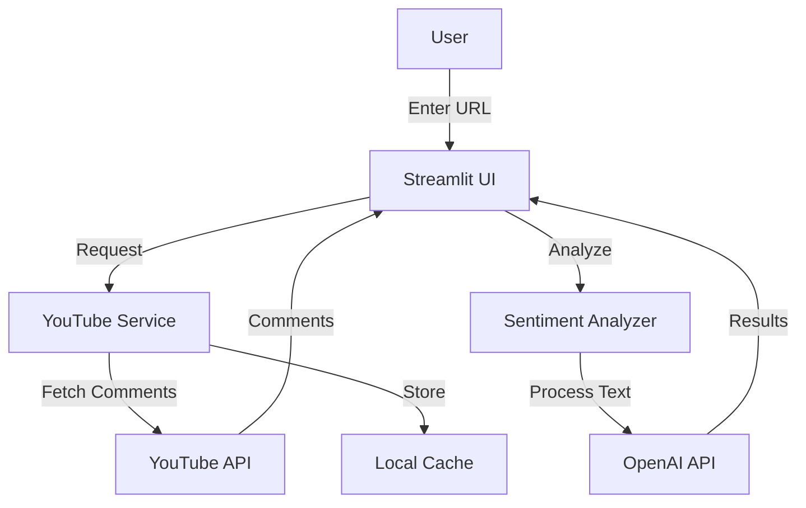
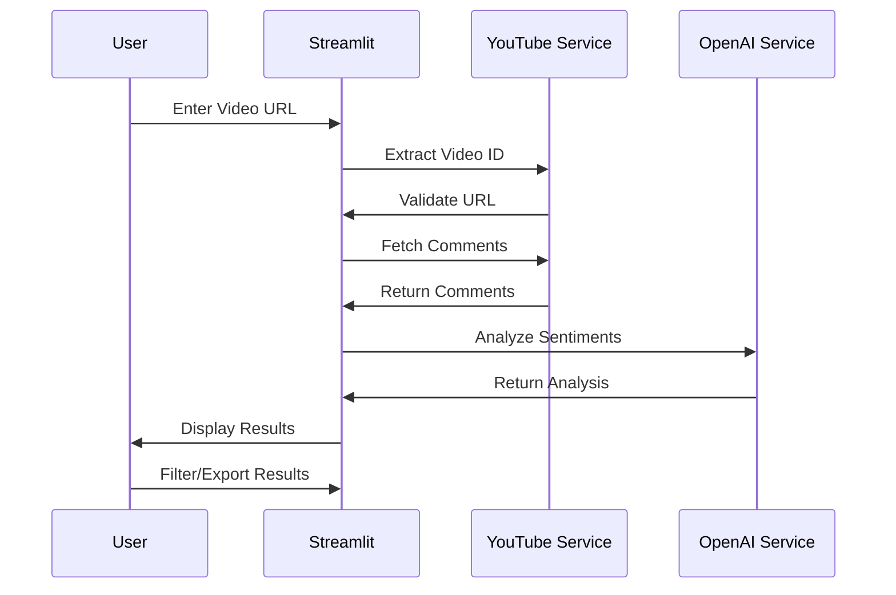
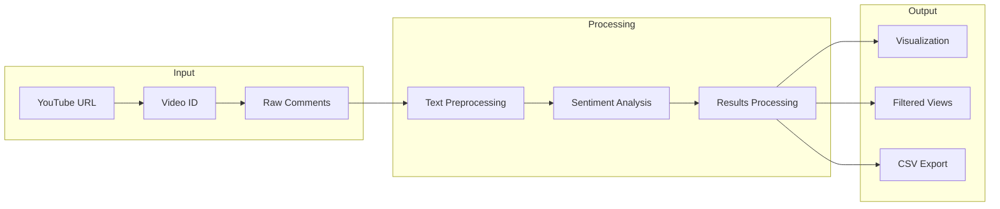
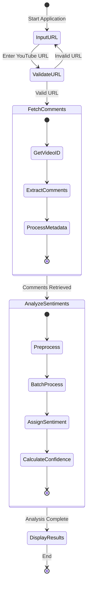

# YouTube Comments Analysis - Technical Specification

## 1. System Overview
The application will analyze YouTube video comments using OpenAI's language models to determine sentiment and provide insights.

## 1.1 System Architecture

## 1.2 Comment Analysis Flow

## 1.3 Data Flow

## 1.4 Application Workflow

## 2. Core Components

### 2.1 User Interface
- Streamlit-based web application
- Input form for YouTube URL
- Display of comments and sentiment analysis results
- Filtering and export options

### 2.2 Backend Services
- YouTube Service for fetching comments
- Sentiment Analyzer using OpenAI API
- Local caching for performance optimization

### 2.3 APIs and Libraries
- YouTube Data API v3 for comment retrieval
- OpenAI GPT API for sentiment analysis
- Streamlit for UI development
- Pandas for data manipulation
- Matplotlib/Seaborn for data visualization

### 2.4 Data Processing
- Comment text preprocessing
- Sentiment categorization
- Confidence scoring
- Trend analysis
- Data storage and caching

## 3. Technical Requirements

### 3.1 APIs and Services
- YouTube Data API v3
- OpenAI GPT API
- Local storage for caching

### 3.2 Data Models
- Comment Schema
  - comment_id: str
  - text: str
  - author: str
  - timestamp: datetime
  - likes: int
  - sentiment: str
  - confidence: float

### 3.3 Performance Requirements
- Handle videos with up to 10,000 comments
- Process 100 comments per minute
- Maximum analysis time: 15 minutes per video
- Cache results for 24 hours

## 4. User Flow
1. User enters YouTube URL
2. Application validates URL
3. System extracts comments
4. Batch processing of comments through OpenAI
5. Real-time update of analysis progress
6. Display of results and visualizations
7. Option to export analysis

## 5. Future Enhancements
- Multiple language support
- Custom sentiment categories
- Historical analysis comparison
- User authentication
- Saved analysis history
- API endpoint for programmatic access

## 6. Security Considerations
- API key storage in environment variables
- Rate limiting implementation
- Data retention policies
- Error logging and monitoring
- Input validation and sanitization
